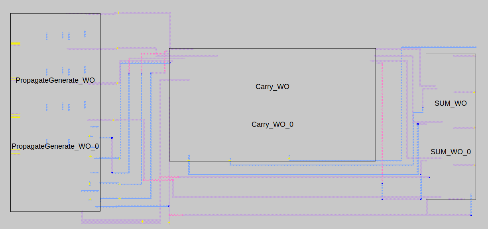

# **VLSI-Project**
## **Problem Statement:**

Design a 4-bit carry look ahead (CLA) adder as shown in Fig. 1(i). Different modules of theCLA-adder are shown in Fig. 1(ii). Each output sum bit needs to drive an inverter of size Wp/Wn= 20λ/10λ,whereλ= 0.09μm. As shown in Fig. 1(iii), consider that input bits are available before the rising edge of the clock and the output should be computed and present at the next rising edge of the clock. You can choose any logic style (static, dynamic, mix) to implement the circuit.

  

**Technology Used:180nm**

## **Tools Used:**
1) ngspice
2) MAGIC Layout Design Tool
3) iverilog and gtkwave
### **Magic Layouts**
1) Propagate & Generate Block:

  

2) Carry Look Ahead Block:

  

3) Sum Block:

  

4) 4-bit Carry Look Ahead Adder:

  
  

5) CLA combined with Flip-Flop: 

  
  

### **Verilog Simulation**

  

